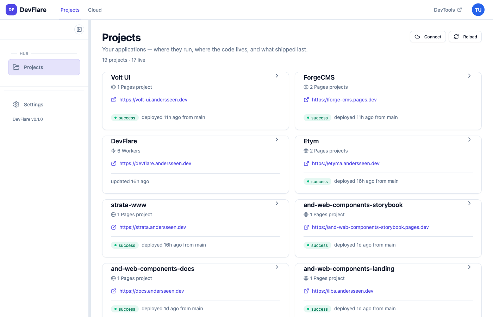
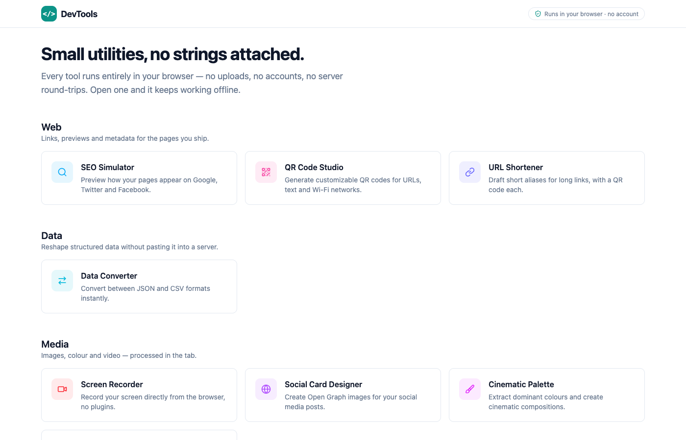

<div align="center">

# DevFlare

**A Cloudflare-focused personal developer platform.**
One monorepo, four products: a project hub, browser utilities, an identity
provider, and a future Cloudflare authorization service.

[](https://github.com/Andersseen/devflare/actions/workflows/ci.yml)
[](https://github.com/Andersseen/devflare/actions/workflows/deploy.yml)
[](LICENSE)
[](https://angular.dev)
[](https://analogjs.org)
[](https://workers.cloudflare.com)

[**DevFlare**](https://devflare.andersseen.dev) · [Volt UI](https://volt-ui.andersseen.dev) · [Agent docs](AGENTS.md) · [Deployment](DEPLOY.md)



</div>

---

## What is in this repository

"DevFlare repo" is this monorepo. "DevFlare" on its own means the project-hub
app. They are not the same thing.

| Product                | Path                      | Purpose                                                  | Status                                       |
| ---------------------- | ------------------------- | -------------------------------------------------------- | -------------------------------------------- |
| **DevFlare**           | `apps/devflare`           | Personal project hub — projects, where they run, deploys | Live at `devflare.andersseen.dev`            |
| **DevTools**           | `apps/devtools`           | Browser-first developer utilities, anonymous, static     | Builds and runs locally; not deployed yet    |
| **DevAuth**            | `apps/dev-auth` + SDK     | OAuth 2.1 / OIDC identity provider + `@dev-auth/*` SDK   | Live at `auth-devflare.andersseen.dev`       |
| **Cloudflare Connect** | `apps/cloudflare-connect` | Future delegated Cloudflare authorization broker         | Placeholder only — health endpoint, no OAuth |

Each app has its own README defining what it is and is not.

### DevFlare — personal project hub

Every project at a glance: its live URL, its repository, the Cloudflare Pages
projects and Workers behind it, and what deployed last. Open a project for its
resources, deployment history, redeploy, and links to roll back. A **Cloud**
section keeps the raw, account-wide view of Workers, Pages, D1, KV and R2.
Signs in through DevAuth. → [apps/devflare/README.md](apps/devflare/README.md)

Not yet: analytics, logs, health checks or alerts.

### DevTools — browser-first utilities

Small tools that run entirely in the tab — no uploads, no account, no server.
Prerendered to static files, so it costs next to nothing to host.
→ [apps/devtools/README.md](apps/devtools/README.md)

| Category | Tools                                                                           |
| -------- | ------------------------------------------------------------------------------- |
| Web      | SEO Simulator · QR Code Studio · URL Shortener (local drafts only)              |
| Data     | Data Converter (JSON ⇄ CSV)                                                     |
| Media    | Screen Recorder · Social Card Designer · Cinematic Palette · Background Remover |

Image compression and SVG optimisation live in Imageryx, a separate project.



### DevAuth — identity provider

A standalone OAuth 2.1 / OIDC provider (Hono + better-auth + D1) that DevFlare
and applications in other repositories sign in against, plus the published
`@dev-auth/core`, `@dev-auth/client`, `@dev-auth/angular` and
`@dev-auth/elements` SDK packages. → [apps/dev-auth/README.md](apps/dev-auth/README.md)

### Cloudflare Connect — not built yet

The boundary for a future service that answers "which Cloudflare resources may
this app touch?". Today DevFlare holds its own single-tenant Cloudflare
connection. → [apps/cloudflare-connect/README.md](apps/cloudflare-connect/README.md)

## Architecture

```
Browser ──► DevFlare (Analog/Nitro Worker)        devflare.andersseen.dev
              │  /api/auth/*   ── OIDC ─────────► DevAuth (Hono Worker)
              │  /api/v1/*     ── h3 handlers ──► D1  devflare-db
              │  /api/v1/cloud ── Cloudflare API (owner's account)
              │  /tools/*      ── 302 ──────────► DevTools (when DEVTOOLS_URL is set)

Browser ──► DevTools (static assets only — no Worker, no bindings)

DevAuth ──► D1 dev-auth-db-prod (users, sessions, OAuth) · KV (rate limits)
```

DevFlare and DevTools never import each other; shared code goes through
`libs/shared/*`. Full map and dependency rules:
[docs/ai/ARCHITECTURE.md](docs/ai/ARCHITECTURE.md).

| Environment | DevFlare                  | DevTools         | DevAuth                        |
| ----------- | ------------------------- | ---------------- | ------------------------------ |
| Production  | `devflare.andersseen.dev` | — (not deployed) | `auth-devflare.andersseen.dev` |
| Local       | `localhost:4200`          | `localhost:4300` | `localhost:8787`               |

## Tech stack

| Layer          | Technology                                                                                    |
| -------------- | --------------------------------------------------------------------------------------------- |
| Meta-framework | [AnalogJS 2.4](https://analogjs.org) (Vite + Nitro; SSR for DevFlare, prerender for DevTools) |
| UI             | [Angular 21](https://angular.dev) — standalone, zoneless, signals                             |
| Components     | [Volt UI](https://volt-ui.andersseen.dev) (`@voltui/components`)                              |
| Styling        | [Tailwind CSS 4](https://tailwindcss.com), shared tokens in `libs/shared/ui`                  |
| Monorepo       | [Nx 22](https://nx.dev) + [pnpm](https://pnpm.io)                                             |
| Auth           | [better-auth](https://better-auth.com) on [Hono](https://hono.dev)                            |
| Data           | [Cloudflare D1](https://developers.cloudflare.com/d1/) via [db0](https://github.com/unjs/db0) |
| Hosting        | [Cloudflare Workers](https://workers.cloudflare.com) + Static Assets                          |
| Testing        | [Vitest](https://vitest.dev) + [Playwright](https://playwright.dev)                           |

## Quick start

**Requirements:** Node.js 22+, pnpm 9+.

```bash
pnpm install
cp .env.sample .env       # fill in your values
pnpm db:migrate:local     # set up the local D1 databases
pnpm dev:all              # DevAuth :8787 · DevFlare :4200 · DevTools :4300
pnpm seed:user            # in another terminal
```

Open <http://localhost:4200> and sign in with `test@devflare.com` /
`TestPass123`. DevTools at <http://localhost:4300> needs no account and no
other service.

| Script           | Starts                |
| ---------------- | --------------------- |
| `pnpm dev:all`   | All three             |
| `pnpm dev:auth`  | DevAuth only → :8787  |
| `pnpm dev:app`   | DevFlare only → :4200 |
| `pnpm dev:tools` | DevTools only → :4300 |

## Scripts

Everything runs from the repo root — the Cloudflare scripts wrap
`wrangler --cwd`, so there is never a `cd`.

| Script                  | Description                                             |
| ----------------------- | ------------------------------------------------------- |
| `pnpm check`            | format → lint → typecheck → test → build                |
| `pnpm build`            | Build DevFlare and DevTools (`build:app`/`build:tools`) |
| `pnpm db:migrate:local` | Apply D1 migrations locally                             |
| `pnpm db:migrate`       | Apply D1 migrations to production                       |
| `pnpm deploy:dry`       | Build and validate DevAuth + DevFlare, ship nothing     |
| `pnpm deploy:all`       | Deploy DevAuth, then DevFlare                           |
| `pnpm cf:tail:app`      | Live DevFlare production logs                           |
| `pnpm cf:app <args>`    | Escape hatch → `wrangler --cwd apps/devflare`           |
| `pnpm cf:tools <args>`  | Escape hatch → `wrangler --cwd apps/devtools`           |

Run `pnpm check` before opening a PR — CI runs the same gates plus E2E.

## Repository layout

```
devflare/
├── apps/
│   ├── devflare/            # Project hub: Analog app + Nitro server → Worker
│   ├── devflare-e2e/        # Playwright E2E for DevFlare
│   ├── devtools/            # Browser utilities: Analog, prerendered → static assets
│   ├── devtools-e2e/        # Playwright E2E for DevTools
│   ├── dev-auth/            # Identity provider: Hono + better-auth + D1
│   └── cloudflare-connect/  # Placeholder for the Cloudflare authorization broker
├── libs/
│   ├── shared/core/         # @org/core — DevFlare platform services
│   ├── shared/ui/           # @org/ui — shared primitives + design tokens (theme.css)
│   ├── shared/dev-auth-*/   # @dev-auth/* — DevAuth consumer SDK (published to npm)
│   └── deploy/              # @org/deploy — DevFlare's Pages direct-upload helpers
└── docs/
    ├── ai/                  # Architecture, conventions, workflows, state
    └── specs/               # Spec-driven development records
```

## Conventions

- **Standalone Angular only** — no NgModules. Pages use `export default class`.
- **Signals over RxJS** for component state; `inject()` over constructor injection.
- **Business logic out of pages** — DevFlare's in `@org/core`, DevTools' in
  colocated services under `apps/devtools/src/app/tools`.
- **Tools run in the browser.** A DevTools utility never gets a server route.
- **Apps never import apps.** Enforced by Nx `domain:*` tags.
- Server routes use h3 `defineEventHandler`, with `db.sql` tagged templates —
  never string-concatenated SQL.

Full detail in [AGENTS.md](AGENTS.md) and [docs/ai/CONVENTIONS.md](docs/ai/CONVENTIONS.md).

## Deployment

Push to `main` deploys DevAuth and DevFlare via GitHub Actions. DevTools has
build and preview configuration but no domain or deploy job yet. Manual:

```bash
pnpm deploy:dry     # validate first
pnpm deploy:all
```

Full setup — resources, secrets, domains, verification — in [DEPLOY.md](DEPLOY.md).

## Contributing

Issues and PRs welcome. Branch from `main` as `feature/*`, use `feat:` / `fix:`
commit prefixes, and make sure `pnpm check` passes.

## License

[MIT](LICENSE) © [andersseen](https://github.com/Andersseen)
