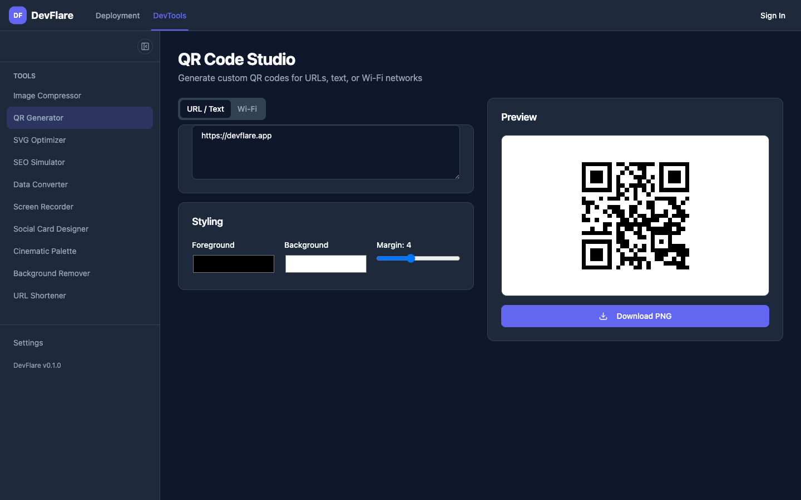

<div align="center">

# DevFlare

**Developer tools, reimagined.**
A suite of browser-first developer utilities — no uploads, no accounts, no server round-trips.

[](https://github.com/Andersseen/devflare/actions/workflows/ci.yml)
[](https://github.com/Andersseen/devflare/actions/workflows/deploy.yml)
[](LICENSE)
[](https://angular.dev)
[](https://analogjs.org)
[](https://workers.cloudflare.com)

[**Live app**](https://devflare.andersseen.dev) · [Volt UI](https://volt-ui.andersseen.dev) · [Agent docs](AGENTS.md) · [Deployment](DEPLOY.md)


</div>

---

## What this is

DevFlare is a developer-tools platform where **every tool runs entirely in your
browser**. Image compression, QR generation, background removal and colour
extraction never leave the tab — there is no upload step and no processing
server to trust.

Around those tools sits a small platform layer: authentication, projects and
deployments, backed by a standalone auth microservice. The whole thing runs on
Cloudflare Workers.

## Tools

All client-side. Open one and it works offline after first load.

| Tool                     | What it does                                             |
| ------------------------ | -------------------------------------------------------- |
| **Image Compressor**     | Optimize PNG, JPEG and WEBP locally with Web Workers     |
| **QR Code Studio**       | Customizable QR codes for URLs, text and Wi-Fi networks  |
| **SVG Optimizer**        | Minify and clean up SVG markup                           |
| **SEO Simulator**        | Preview how pages appear on Google, Twitter and Facebook |
| **Data Converter**       | Convert between JSON and CSV                             |
| **Screen Recorder**      | Record your screen from the browser, no plugins          |
| **Social Card Designer** | Generate Open Graph images for social posts              |
| **Cinematic Palette**    | Extract dominant colours and build palettes              |
| **Background Remover**   | AI background removal, fully client-side                 |
| **URL Shortener**        | Short links with custom aliases                          |



## Architecture

```
Browser ──► devflare (Analog/Nitro Worker)
              │  /api/auth/*  ── proxy ──────────► dev-auth (Hono Worker)
              │  /api/v1/*    ── h3 handlers ───► D1  devflare-db
              │
              └─ session: server calls dev-auth /get-session with the request cookies

dev-auth ──► D1  dev-auth-db-prod   (users, sessions — Drizzle schema)
         ──► KV                     (rate limiting)
```

Two databases on purpose: auth data lives in the auth service, app data lives in
the app. They share nothing but a `userId` string.

| Environment | App                       | Auth                           |
| ----------- | ------------------------- | ------------------------------ |
| Production  | `devflare.andersseen.dev` | `auth-devflare.andersseen.dev` |
| Local       | `localhost:4200`          | `localhost:8787`               |

## Tech stack

| Layer          | Technology                                                                                    |
| -------------- | --------------------------------------------------------------------------------------------- |
| Meta-framework | [AnalogJS 2.4](https://analogjs.org) (Vite + Nitro, SSR)                                      |
| UI             | [Angular 21](https://angular.dev) — standalone, zoneless, signals                             |
| Components     | [Volt UI](https://volt-ui.andersseen.dev) (`@voltui/components`)                              |
| Styling        | [Tailwind CSS 4](https://tailwindcss.com)                                                     |
| Monorepo       | [Nx 22](https://nx.dev) + [pnpm](https://pnpm.io)                                             |
| Auth           | [better-auth](https://better-auth.com) on [Hono](https://hono.dev)                            |
| Data           | [Cloudflare D1](https://developers.cloudflare.com/d1/) via [db0](https://github.com/unjs/db0) |
| Hosting        | [Cloudflare Workers](https://workers.cloudflare.com) + Static Assets                          |
| Testing        | [Vitest](https://vitest.dev) + [Playwright](https://playwright.dev)                           |
| Monitoring     | [Sentry](https://sentry.io)                                                                   |

## Quick start

**Requirements:** Node.js 22+, pnpm 9+.

```bash
pnpm install
cp .env.sample .env       # fill in your values
pnpm db:migrate:local     # set up the local D1 databases
pnpm dev:all              # app on :4200, auth on :8787
pnpm seed:user            # in another terminal
```

Open <http://localhost:4200> and sign in with `test@devflare.com` /
`TestPass123`.

Local data lives in wrangler's miniflare state under `apps/*/.wrangler/` — both
databases are real D1, just running locally, so there is no separate dev
database engine to keep in sync.

<details>
<summary>Other ways to start the dev servers</summary>

```bash
./scripts/dev-macos.sh    # macOS: separate Terminal windows
pnpm dev:auth             # just the auth service  → :8787
pnpm dev:app              # just the app           → :4200
```

</details>

<details>
<summary>Hitting the auth service directly</summary>

```bash
curl -X POST http://localhost:8787/api/auth/sign-in/email \
  -H "Content-Type: application/json" \
  -H "Origin: http://localhost:8787" \
  -d '{"email":"test@devflare.com","password":"TestPass123"}' \
  -c cookies.txt

curl http://localhost:8787/api/auth/get-session -b cookies.txt
```

</details>

## Scripts

Everything runs from the repo root — the Cloudflare scripts wrap
`wrangler --cwd`, so there is never a `cd`.

| Script                  | Description                                   |
| ----------------------- | --------------------------------------------- |
| `pnpm dev:all`          | App + auth service together                   |
| `pnpm check`            | format → lint → typecheck → test → build      |
| `pnpm db:migrate:local` | Apply D1 migrations locally                   |
| `pnpm db:migrate`       | Apply D1 migrations to production             |
| `pnpm deploy:dry`       | Build and validate both Workers, ship nothing |
| `pnpm deploy:all`       | Deploy auth, then app                         |
| `pnpm cf:tail:app`      | Live production logs                          |
| `pnpm cf:app <args>`    | Escape hatch → `wrangler --cwd apps/devflare` |

Run `pnpm check` before opening a PR — CI runs exactly that, plus E2E.

## Repository layout

```
devflare/
├── apps/
│   ├── devflare/           # Analog app + Nitro server routes → Cloudflare Worker
│   │   ├── src/app/
│   │   │   ├── pages/      # Route components (*.page.ts, default export)
│   │   │   └── components/ # Shell: navbar, sidebar, shell-navigation, tool-grid
│   │   ├── src/server/     # h3 API routes, D1 access, migrations
│   │   └── wrangler.toml
│   ├── dev-auth/           # Auth microservice: Hono + better-auth + D1
│   │   ├── src/pages/      # Auth UI, compiled from .flow templates
│   │   └── wrangler.toml
│   └── devflare-e2e/       # Playwright E2E
├── libs/shared/
│   ├── core/               # @org/core — all business logic lives here
│   ├── auth/               # @org/auth — auth client + guards
│   └── ui/                 # @org/ui
└── docs/ai/                # Architecture, conventions, workflows, state
```

## Conventions

- **Standalone Angular only** — no NgModules. Pages use `export default class`.
- **Signals over RxJS** for component state; `inject()` over constructor injection.
- **Business logic lives in `@org/core`** — page components stay thin.
- **Tools run in the browser.** A tool never gets a server route.
- Server routes use h3 `defineEventHandler`, with `db.sql` tagged templates —
  never string-concatenated SQL.

Full detail in [AGENTS.md](AGENTS.md) and [docs/ai/CONVENTIONS.md](docs/ai/CONVENTIONS.md).

## Deployment

Push to `main` deploys both Workers via GitHub Actions. Manual:

```bash
pnpm deploy:dry     # validate first
pnpm deploy:all
```

Full setup — resources, secrets, domains, verification — in [DEPLOY.md](DEPLOY.md).

## Contributing

Issues and PRs welcome. Branch from `main` as `feature/*`, use `feat:` / `fix:`
commit prefixes, and make sure `pnpm check` passes.

## License

[MIT](LICENSE) © [andersseen](https://github.com/Andersseen)
